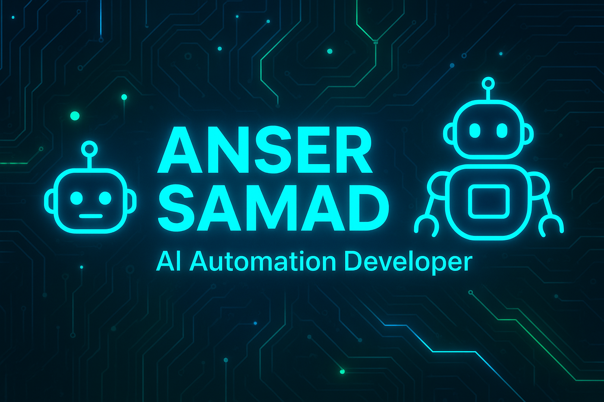

# 👋 Hi — I’m **Anser Samad**
**AI Automation Developer · Prompt Engineering · Python**

I build practical AI tools and automation that save time and create impact.  
Portfolio: https://anser23.github.io/portfolio/ · Hugging Face demo: https://huggingface.co/spaces/anser23/AI

---

## 🚀 About
I design and ship AI-powered automation, chatbots, and data tools. I focus on rapid prototypes that turn into production-ready demos. Open to internships and short-term projects in AI/automation.

---

## 🛠️ Skills
- **Prompt Engineering** ⭐  
- **AI Automation Development** (workflows, agents, pipelines)  
- **Python** (pandas, APIs, automation scripts)  
- **Chatbot Development** (Gradio, conversational UI)  
- **Gradio / Hugging Face Spaces**  
- **Data viz** (Plotly)  
- **Git & GitHub** (clean commits, PRs)

---

## 🔭 Projects (selected)
### Smart AI Dashboard — **Live demo**
A lightweight Gradio + Plotly dashboard with dataset upload, cleaning, instant charts, and a Groq-powered (LLaMA 3) data-aware assistant.  
**Live →** https://huggingface.co/spaces/anser23/AI  
**Code →** https://github.com/anser23/smart-ai-dashboard

### Smart AI Chatbot — **Interactive**
An AI chatbot demo built with Gradio, focusing on safe, helpful conversation and real-world prompts.  
**Live →** *(add if hosted)*  
**Code →** https://github.com/anser23/smart-ai-chatbot

---

## 🎯 What I bring
- Rapid prototype → demo → iterate workflow  
- Clean UX for AI tools (usable, not just research)  
- Practical automation: integrate APIs, schedule jobs, and deliver observable value

---

## 📫 Contact
- Portfolio: https://anser23.github.io/portfolio/  
- GitHub: https://github.com/anser23  
- LinkedIn: https://linkedin.com/in/anser23

---

## 📎 Nice to have visuals

